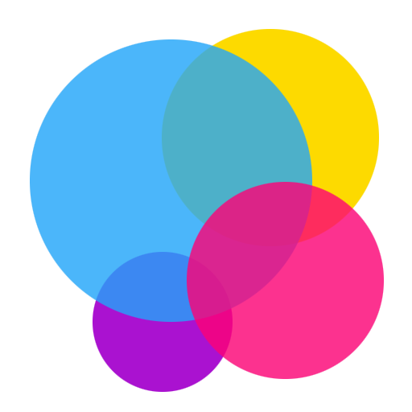
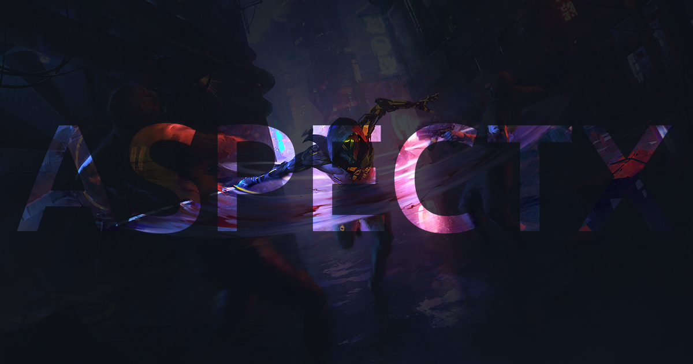

<div id="top"></div>

<!-- PROJECT LOGO -->
<br />
<div align="center">
  <a href="https://www.aspectx.info/">
    
  </a>

<h3 align="center">AspectX</h3>

  <p align="center">
    Explore Video Games Like Never Before
    <br />
    <a href="https://www.aspectx.info/"><strong>View The Live Version »</strong></a>
    <br />
    <br />
    <a href="https://github.com/Yazdun/aspectx.info/issues">Report Bug</a>
    ·
    <a href="https://github.com/Yazdun/aspectx.info/issues">Request Feature</a>
  </p>


[](LIVE)


</div>
<br />
<br />

<br />
<br />

## About this project

AspectX is a NextJs application, Built upon [RAWG API](https://rawg.io/apidocs).
Users can view and explore different kind of video games and game developers,
trending games and must play games.

This app features SSR,SSG and CSR for different pages and each page is being
rendered differently.

I built this project to expand my knowledge on NextJs and server side rendering
and there is no copyright on this repo, so feel free to use any piece of code
you find here.

## How to run this project

1. This project is built upon [RAWG API](https://rawg.io/apidocs), so before
   doing anything, you need to sign up an account in
   [RAWG](https://rawg.io/login?forward=developer) and get your free API key.

2. then you need to fork or clone the project :

```bash
git@github.com:Yazdun/aspectx.info.git
```

3. install the dependencies:

```bash
npm install
```

4. Inside root directory, create a `.env.local` and insert your API KEY like
   this :

```bash
NEXT_PUBLIC_API_KEY=YOUR API KEY
```

5. Then save the `.env.local` and run the project:

```bash
npm run dev
```

## Contributing

Thank you for browsing this repo. Any contributions you make are **greatly
appreciated**.

If you have a suggestion that would make this better, please fork the repo and
create a pull request. You can also simply open an issue with the tag
"enhancement". Don't forget to give the project a star! Thanks again!

1. Fork the Project
2. Create your Feature Branch (`git checkout -b feature/AmazingFeature`)
3. Commit your Changes (`git commit -m 'Add some AmazingFeature'`)
4. Push to the Branch (`git push origin feature/AmazingFeature`)
5. Open a Pull Request
